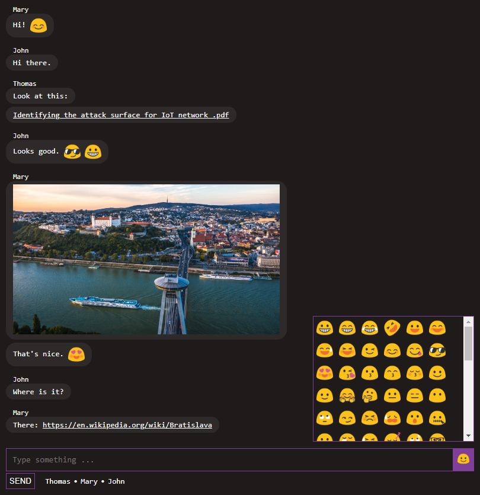

# chat
Simple plug & play real-time JavaScript chat implemented using Socket.io.

Where simplicity meets usability:

* No user accounts - just enter nickname and join.
* No history saved - only logged-in users can see recent history.
* No configuration.
* Only one room - you can't create any other rooms or write PM to others.
* Files sharing is possible - without storing any data on server.
* Emojis - just a few of them.



## Run using Docker

**Build docker image**

```
docker build -t m1k1o/chat:latest .
```

**Run docker container**

```
docker run -d \
	--name chat \
	-p 80:80 \
	m1k1o/chat:latest
```

## How to install

Requirements: `nodejs`, `npm`

1. Clone this repository.
	- `git clone https://github.com/m1k1o/chat .`
2. Install server dependencies.
	- `npm install`
3. Run server (default port is `80`).
	- `npm start [custom_port]`
4. Done, visit your chat in browser.
